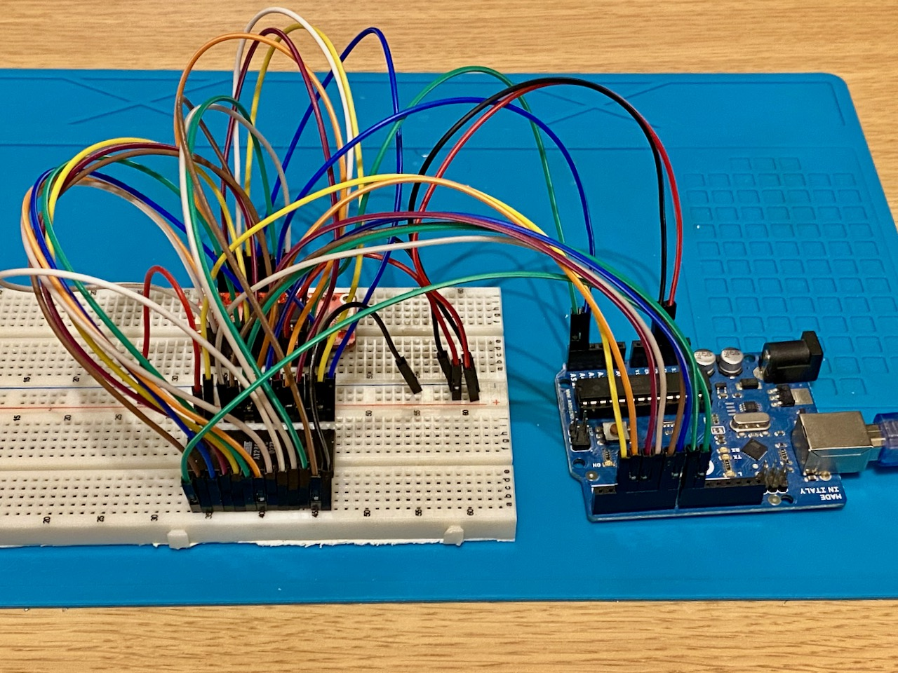
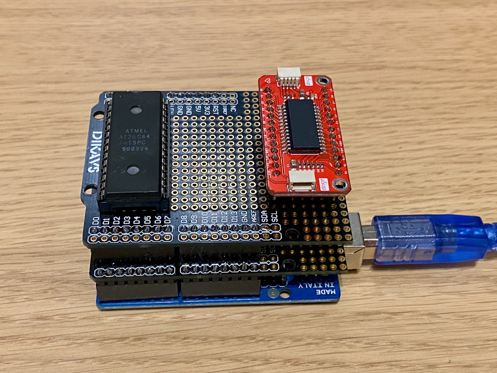

# AT28C EEPROM Programmer

Simple EEPROM (AT28C64/AT28C256) programmer using an Arduino UNO board and MCP23017 I/O expander. This project includes both
Arduino firmware and a Python command-line interface tool for easy operation.

## Hardware Requirements

- Arduino board (Uno, Nano, or compatible)
- MCP23017 I/O expander - https://www.laskakit.cz/laskakit-mcp23017-i2c-16-bit-i-o-expander/
- AT28C64 or AT28C256 EEPROM
- Breadboard and jumper wires

### Recommended Components

- 3x 10kΩ pull-down resistors (for WE, OE, and CS pins)

### Wiring Diagram

**Breadboard version**



**UNO prototype shield version**



#### Arduino to MCP23017

- A4 → SDA
- A5 → SCL
- 5V → VDD
- GND → VSS
- MCP23017 A0,A1,A2 → GND (I2C address 0x20)

#### Arduino to AT28C64/256

```
Arduino   AT28C64/256
Pin 2  → WE  (Pin 27)
Pin 3  → OE  (Pin 22)
Pin 4  → CE  (Pin 20)
Pin 5  → A8  (Pin 25)
Pin 6  → A9  (Pin 24)
Pin 7  → A10 (Pin 21)
Pin 8  → A11 (Pin 23)
Pin 9  → A12 (Pin 2)
Pin 10 → A13 (Pin 1)  [AT28C256 only]
Pin 11 → A14 (Pin 31) [AT28C256 only]
```

#### MCP23017 to AT28C64/256

```
PORTA:                  PORTB:
PA0 → D0 (Pin 11)      PB0 → A0 (Pin 10)
PA1 → D1 (Pin 12)      PB1 → A1 (Pin 9)
PA2 → D2 (Pin 13)      PB2 → A2 (Pin 8)
PA3 → D3 (Pin 15)      PB3 → A3 (Pin 7)
PA4 → D4 (Pin 16)      PB4 → A4 (Pin 6)
PA5 → D5 (Pin 17)      PB5 → A5 (Pin 5)
PA6 → D6 (Pin 18)      PB6 → A6 (Pin 4)
PA7 → D7 (Pin 19)      PB7 → A7 (Pin 3)
```

## Software Setup

### 1. Arduino Firmware

1. Open the Arduino sketch in VS Code with PlatformIO support
2. Upload the firmware to your Arduino board

### 2. Python CLI Tool

1. Install Python 3.6 or higher
2. Install required package:
   ```bash
   pip install pyserial
   ```

## Usage

### Arduino Direct Commands

When connected via serial monitor (115200 baud), the following commands are available:

- `E` - Erase EEPROM
- `T` - Full EEPROM test
- `D` - Dump EEPROM contents
- `W` - Write Intel HEX data to EEPROM
- `R` - Write default ROM data from UNO flash
- `X` - Enable write protection
- `S` - Disable write protection
- `?` - Help

### Python CLI Interface

The Python tool provides a more user-friendly interface with the following options:

```bash
# List available Arduino ports
python eeprom_programmer.py --list

# Read EEPROM contents
python eeprom_programmer.py --read
python eeprom_programmer.py --read --output dump.hex
python eeprom_programmer.py --read --output dump.bin --format bin

# Write Intel HEX file
python eeprom_programmer.py --write firmware.hex

# Erase EEPROM
python eeprom_programmer.py --clean

# Specify port manually
python eeprom_programmer.py --port COM3 --read
```

## Features

- Support for AT28C64 and AT28C256 EEPROM chips
- Hardware write protection control
- Intel HEX file format support
- Auto-detection of Arduino ports
- Data verification after writing
- Configurable erase patterns
- Page-by-page memory dumping

## Troubleshooting

### Common Issues

1. **MCP23017 Initialization Failed**
    - Check I2C connections (SDA/SCL)
    - Verify MCP23017 address pins are properly grounded
    - Check power connections

2. **Write Verification Errors**
    - Verify EEPROM is not write-protected
    - Check all data and address line connections
    - Ensure stable power supply

3. **Cannot Detect Arduino**
    - Check USB connection
    - Verify correct drivers are installed
    - Try a different USB port
